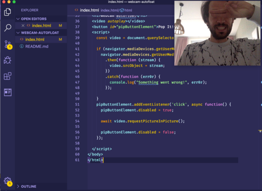

# webcam-autofloat

simplest and cheapest solution to having an automaticlly floating on top window with my webcam for streaming purposes

This is nothing more than a view of my webcam using
[`getUserMedia`](https://developer.mozilla.org/en-US/docs/Web/API/MediaDevices/getUserMedia) and then having a button that
requests a [picture-in-picture](https://developers.google.com/web/updates/2018/10/watch-video-using-picture-in-picture) mode.

Now you can stream and do code video's with your own head talking back to you

